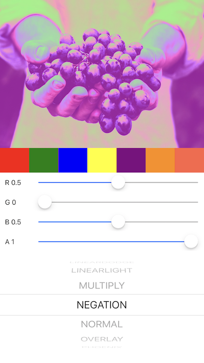

# gl-react-color-blending

Color blending shaders for [gl-react](https://github.com/gre/gl-react) and [gl-react-expo](https://github.com/gre/gl-react/tree/master/packages/gl-react-expo).

Implementations from [jamieowen/glsl-blend](https://github.com/jamieowen/glsl-blend).

Check out the example React Native app in the `examples` folder.

`cd examples/color-blending && npm install && npm start`



## Install

`npm install gl-react gl-react-color-blending --save`

## Usage with gl-react-expo

```
import { Surface } from 'gl-react-expo';
import ColorBlending from 'gl-react-color-blending';

// ...

<Surface style={{ width: WINDOW_WIDTH, height: 300 }}>
    <ColorBlending
        color={[0.1, 0.9, 0.1, 1]}
        blendMode="blendAdd"
    >
      {{ uri: 'https://i.imgur.com/iPKTONG.jpg' }}
    </ColorBlending>
</Surface>
```

`color`: must be a `array` with the length of 4 (RGBA format). Values must be a real value between 0 and 1.

`blendMode` is a string, one of the followings:

1. `blendAdd`
2. `blendAverage`
3. `blendColorBurn`
4. `blendColorDodge`
4. `blendDarken`
5. `blendDifference`
6. `blendExclusion`
7. `blendHardLight`
9. `blendHardMix`
10. `blendLighten`
11. `blendLinearBurn`
12. `blendLinearDodge`
13. `blendLinearLight`
14. `blendMultiply`
15. `blendNegation`
16. `blendNormal`
17. `blendOverlay`
18. `blendPhoenix`
19. `blendPinLight`
20. `blendReflect`
21. `blendScreen`
22. `blendSoftLight`
23. `blendSubstract`
24. `blendSubtract`
25. `blendVividLight`

## Other API

`import ColorBlending, { blendNames, blendShaderCodes } from 'gl-react-color-blending';`

`blendNames`: Every supported blend mode as an array of strings.

`blendShaderCodes`: Shader codes in plain text (glsl code). You can inject it to your own shader.

## Licence

MIT
